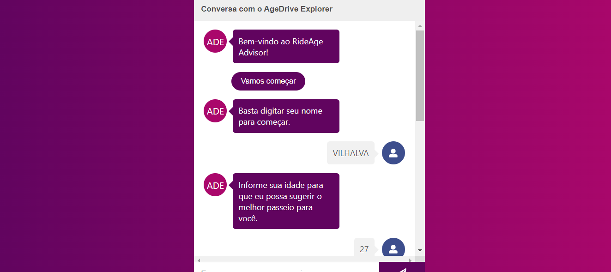
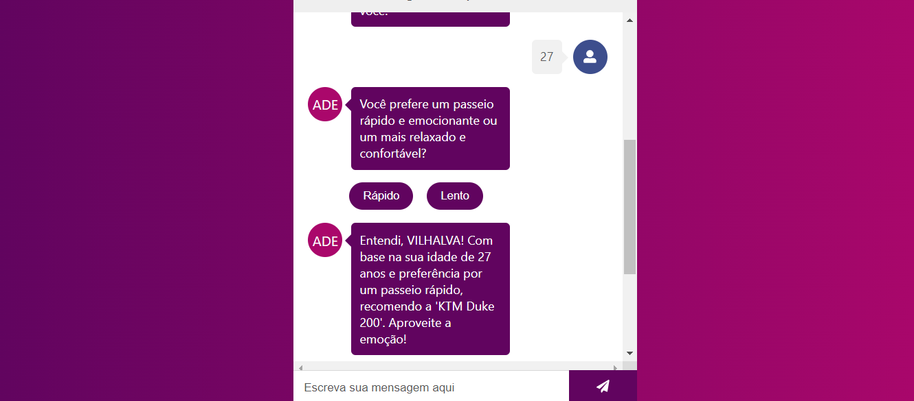
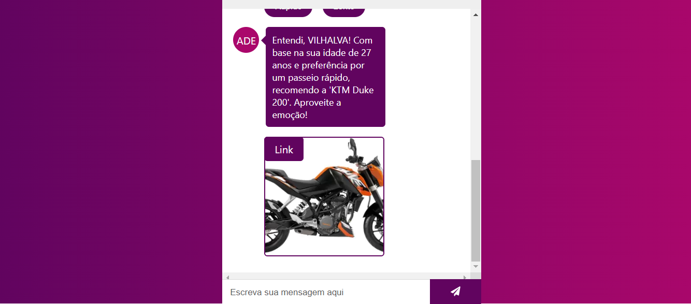

# RIDEAGE ADVISOR
👨‍🏫PROJETO CRIADO PARA O CURSO DE REACT CHATBOT KIT.

 <br>
 <br>
 <br>

## DESCRIÇÃO:
O projeto "RideAge Advisor" é um assistente virtual desenvolvido para ajudar os usuários a escolherem o melhor passeio de moto com base em sua idade e preferências. 

## FUNCIONALIDADES:
1. **Inicialização e Identificação:** O bot inicia a conversa pedindo ao usuário que digite seu nome.
2. **Coleta de Informações:** Solicita a idade do usuário para personalizar a recomendação.
3. **Seleção de Preferência:** Oferece opções de escolha entre um passeio rápido e emocionante ou um mais relaxado e confortável através de botões interativos.
4. **Recomendação Personalizada:** Baseado na idade e na preferência escolhida, o bot sugere um modelo de moto ideal para o usuário.
5. **Visualização da Recomendação:** Apresenta uma imagem da moto recomendada junto com um link para mais informações ou para a compra.

## EXECUTANDO O PROJETO:   
1. **Instalando as Depêndencias:**
   - Para instalar as dependências listadas no arquivo "package.json", você pode usar o comando `npm install` no terminal. Certifique-se de estar no diretório do seu projeto onde o arquivo "package.json" está localizado (`CODIGO`). O npm irá ler o arquivo "package.json" e instalar todas as dependências listadas nele. 

   ```bash
   npm install
   ```

2. **Inicie o Bot:**
   - Inicie o bot com o seguinte comando:
    ```bash
    npm start
    ```

   - Acesse o BOT no navegador visitando `[http://localhost:3000/](http://localhost:3000/)`.

3. **Interagindo com o Bot:**
   - **Passo 1:** Digite seu nome para iniciar a interação com o bot.
   - **Passo 2:** Informe sua idade quando solicitado pelo bot.
   - **Passo 3:** Escolha entre um passeio rápido e emocionante ou um mais relaxado e confortável clicando nos botões correspondentes.
   - **Passo 4:** Após fazer sua escolha, o bot irá sugerir uma moto específica que melhor se adequa à sua idade e preferência.
   - **Passo 5:** Visualize a recomendação, incluindo uma imagem da moto, e siga o link fornecido para mais detalhes.

## NÃO SABE?
- Entendemos que para manipular arquivos em muitas linguagens e tecnologias relacionadas, é necessário possuir conhecimento nessas áreas. Para auxiliar nesse aprendizado, oferecemos cursos gratuitos disponíveis:
* [CURSO DE REACT](https://github.com/VILHALVA/CURSO-DE-REACT)
* [CURSO DE JAVASCRIPT](https://github.com/VILHALVA/CURSO-DE-JAVASCRIPT)
* [CURSO DE HTML E CSS](https://github.com/VILHALVA/CURSO-DE-HTML-E-CSS)
* [CURSO DE NODEJS](https://github.com/VILHALVA/CURSO-DE-NODEJS)
* [CONFIRA MAIS CURSOS](https://github.com/VILHALVA?tab=repositories&q=+topic:CURSO)

## CREDITOS:
- [PROJETO CRIADO PARA CURSO DE REACT CHATBOT KIT](https://github.com/VILHALVA/CURSO-DE-REACT-CHATBOT-KIT)
- [PROJETO FEITO PELO VILHALVA](https://github.com/VILHALVA)

